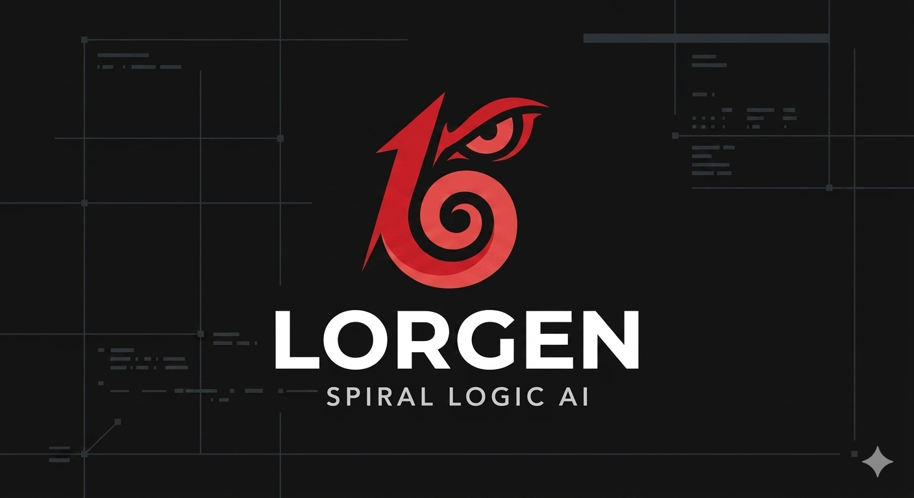

<p align="center">
  
</p>

# Lorgen — リポジトリ知識キュレーター

> ソースコードだけでは語れない**「なぜそうなっているか」**(設計判断、
> 経緯、トレードオフ、教訓) を捕捉・蓄積する。すべてをリポジトリ内の
> Markdown として保存するので、人間と AI エージェントの双方が同じ知識
> ベースを読み、育てていける。

名前は『天元突破グレンラガン』に登場する**生体コンピュータ**
「ロージェノム」(Lordgenome) を縮めて **Lorgen**。記憶と知識の集積体
としてヒトの叡智を蓄え、必要なときに引き出す ── そんな役割を本
プラグインがリポジトリに対して果たす、というイメージ。

Lorgen は **Claude Code プラグイン**として配布される。一度インストール
すれば、「なぜ」を捕捉・取得したい全リポジトリで使える。

---

## アーキテクチャ

### このリポジトリ (`lorgen`) ── プラグインソース + 自身のデータ

```
lorgen/
├── .claude-plugin/
│   └── plugin.json                          # プラグインマニフェスト (name, version, ...)
├── agents/
│   └── lorgen.md                             # subagent 定義
├── skills/
│   ├── lorgen/                               # 操作マニュアル (multi-file skill)
│   │   ├── SKILL.md
│   │   ├── schema.md
│   │   ├── retrieval.md
│   │   ├── accumulation.md
│   │   ├── sources.md
│   │   ├── onboard.md
│   │   ├── logging.md
│   │   └── metrics.md                       # logs → metrics の compile contract
│   └── review/
│       └── SKILL.md                         # 4-role multi-agent code review (main-agent skill)
├── commands/
│   └── review.md                            # slash command エントリ (/lorgen:review)
├── hooks/
│   └── hooks.json                           # PreToolUse: Write|Edit redaction guard
├── bin/
│   ├── lorgen-pretool-guard                  # hooks/hooks.json から呼ばれる
│   ├── lorgen-redact-check                   # secret パターンスキャナ (exit 1 = ブロック)
│   ├── lorgen-redact                         # redact ラッパー (stdout)
│   └── lorgen-compile-metrics                # jq のみで動く決定論的 compile
├── .lorgen/                                  # データストア (このリポ自身。dogfood)
│   ├── config.yaml                          (tracked)
│   ├── .gitignore                           (tracked) cache/ + state.json + logs/ を除外
│   ├── knowledge/                           (tracked)
│   │   ├── conventions/
│   │   └── decisions/
│   ├── wiki/                                (tracked)
│   │   ├── overview.md
│   │   └── architecture.md
│   ├── adr/                                 (tracked) outputs.write_adr=true 時にのみ生成
│   │   └── 0001-<slug>.md
│   ├── metrics/                             (tracked) per-session 集計 JSON
│   │   └── 20260429-102345-a3f9c2.json
│   ├── logs/                                (gitignored) raw per-session JSONL
│   ├── cache/                               (gitignored)
│   └── state.json                           (gitignored)
├── docs/
│   └── architecture.md                      # 長文アーキ概要 (living doc)
└── README.md
```

### あなたのアプリリポジトリ (`/plugin install lorgen` 後)

```
your-app-repo/
├── .claude/
│   └── plugins/
│       └── lorgen/                           # インストール済みプラグイン (project scope)
│           ├── .claude-plugin/plugin.json
│           ├── agents/lorgen.md
│           ├── skills/lorgen/...
│           ├── hooks/hooks.json
│           └── bin/lorgen-*                  # redact-check, compile-metrics ほか
├── .lorgen/                                  # Lorgen のデータストア (初回利用時に生成)
│   ├── config.yaml                          (tracked) チーム共有設定
│   ├── .gitignore                           (tracked) cache/ + state.json + logs/ を除外
│   ├── knowledge/                           (tracked) Knowledge アイテム
│   │   ├── conventions/
│   │   ├── decisions/
│   │   ├── runbooks/
│   │   ├── facts/
│   │   └── lessons/
│   ├── wiki/                                (tracked) Wiki ページ
│   ├── adr/                                 (tracked) outputs.write_adr=true 時に生成
│   │   ├── 0001-decimal-money.md            #   Lorgen が生成した ADR
│   │   └── 0002-aurora-migration.md
│   ├── metrics/                             (tracked) per-session compile 済み集計
│   │   ├── 20260429-102345-a3f9c2.json     #   path / count / timestamp のみ
│   │   ├── 20260429-110512-c8f2d4.json     #   集約による privacy 担保
│   │   └── 20260430-091205-b1e3a7.json
│   ├── logs/                                (gitignored) raw per-session JSONL
│   │   └── 20260429-102345-a3f9c2.jsonl    #   セッション末で metrics/ に compile
│   ├── cache/                               (gitignored) PR/issue/LLM の生キャッシュ
│   └── state.json                           (gitignored) onboard カーソル, indexing state
└── (アプリケーションコード)
```

3 つの構成要素:
- **プラグインソース** (`agents/`, `skills/lorgen/`, `hooks/`, `bin/`,
  `.claude-plugin/plugin.json`) はこのリポジトリにのみ存在する。
  `/plugin install` 時に `.claude/plugins/lorgen/` (プロジェクト) または
  `~/.claude/plugins/lorgen/` (ユーザー) へコピーされる。
- **データストア** (`.lorgen/`) は各ユーザーリポジトリで初回利用時に
  作成される。Knowledge / Wiki / Metrics は tracked、raw logs は
  gitignored。
- **ADR ミラー** (`.lorgen/adr/`) は `outputs.write_adr` が true、または
  per-record で opt-in したときにのみ書き出される。デフォルトはオフ。
  リポジトリ慣習に合わせて出力先を `outputs.adr_dir` で `docs/adr/`
  などへ上書き可能。

**Logs と metrics**: raw per-session ログは `.lorgen/logs/` 配下
(gitignored / マシンごと ── query 文字列、ソース本文、LLM 要約など
secret を含み得るため)。各 invocation の終了時に Lorgen はログを
`.lorgen/metrics/<session>.json` (tracked / チーム共有) に compile する
── path / count / timestamp のみで、集約による privacy 担保。改善
ループ (stale 検出、hot-item 昇格、trigger health) は metrics のみを
読み、raw logs は決して読まない。詳細は
[`skills/lorgen/metrics.md`](skills/lorgen/metrics.md)。

**機械的 secret ガード**: PreToolUse hook
(`hooks/hooks.json` + `bin/lorgen-pretool-guard`) が `.lorgen/**`
(`.lorgen/logs/**` と `.lorgen/cache/**` を除く) と設定済み ADR
ディレクトリへの全 Write/Edit を既知の secret パターンでスキャン
し、マッチした場合は hook 層で書き込みをブロックする。skill 命令
側も多重防御として `bin/lorgen-redact` でコンテンツをパイプする。
パターン一覧は [`bin/lorgen-redact-check`](bin/lorgen-redact-check)。

---

## Lorgen ができること

| あなたが頼むと | Lorgen はこうする |
|---|---|
| `なぜ Decimal を money に使ってる?` | まず `.lorgen/knowledge/` を検索。なければ `git log` / PR 説明 / ADR / コードコメントを読み、引用付きで回答を合成。新しい知見を `.lorgen/knowledge/conventions/decimal-money.md` に保存し、次の質問は即座にヒットする。 |
| `auth モジュールの設計判断履歴を教えて` | `.lorgen/wiki/modules/auth.md` と関連 Knowledge を読む。欠落があれば git/PR/issue を辿り、Wiki を更新。 |
| `この PR の判断を残しておいて` | PR 説明とレビューコメントを蒸留し、引用付きで `decision` 種別の Knowledge を新規作成。 |
| `この repo を onboard して` | 一括スキャン: README / CLAUDE.md / AGENTS.md / ADR / 直近マージ済 PR (デフォルト 30 日 / 50 件) / コードコメント → Wiki overview、モジュール別ページ、シード Knowledge を生成。 |
| `この決定を ADR にして` / `@lorgen record --adr "..."` | Knowledge を `.lorgen/adr/NNNN-<slug>.md` (または `outputs.adr_dir` 指定先) に MADR-lite フォーマットでミラー。連番、不変、Knowledge と双方向リンク。デフォルトはオフ ── per-record か `outputs.write_adr: true` で opt-in。 |
| `過去 1 年遡って onboard して` | 同じ処理を月単位のチャンクで。state-file による再開対応。 |
| `/lorgen:review` | **Knowledge-grounded review**。staged diff (デフォルト) / `--working` / `--range A..B` / `--pr <num>` / `--files <pat>` を、`.lorgen/knowledge/` ・`.lorgen/wiki/` ・`.lorgen/adr/` と照合。**main agent context** で 4 ロールマルチエージェント (Coordinator + Searcher + 並列 Investigators + Comparator) を起動し、過去の決定・慣習・教訓との衝突を `Critical / Warning / Info` で指摘。新しい lesson は `.lorgen/knowledge/lessons/` に蓄積(`--no-write` で抑制)。観点は **Knowledge 整合性のみ** ── 一般的な bug / SOLID / lint は `/review` 等別ツールに任せる。`@lorgen review` は使えない(Claude Code 2.x の subagent は `Task` 不可)。 |

出力は引用付きの Markdown を stdout へ
(`(PR #42)`, `(commit abc1234)`, `(.lorgen/adr/0003-decimal.md)` のような
インライン引用)。ファイルは `.lorgen/` に書き込まれる。Lorgen は
**絶対に** commit / push しない ── 人間が `git diff .lorgen/` をレビュー
してコミットする。

---

## なぜ Lorgen なのか (素の Claude Code との比較)

| Lorgen なし | Lorgen あり |
|---|---|
| 新セッションのたびに README を読み直し / 慣習を grep し直す | 一度蓄積した Knowledge を以後即座に取得 |
| 「なぜここがこうなっているか」は現在のコードからしか答えられない | git 履歴 / PR の根拠 / ADR / 過去の教訓から蒸留して回答 |
| Knowledge は会話と共に消える | Knowledge は `.lorgen/` で生き続け、セッション・コントリビュータ・バージョン管理を超えてチーム共有される |
| 同じ質問は毎回同じトークンを消費 | 反復質問は `.lorgen/knowledge/` のキャッシュにヒットし、ほぼ無料 |

Lorgen は Devin の **Knowledge + DeepWiki** 機能に着想を得つつ、
- リポジトリ内に常駐
- 追加コストなし (Claude Code セッション内で動く)
- 完全に透明 (データモデルはすべて読める / 編集できる / 書き直せる
  プレーンな Markdown)

---

## インストール

```bash
# プロジェクトローカル (プラグインは .claude/plugins/lorgen/ に配置)
/plugin install lorgen@kawazy666/lorgen

# ユーザーグローバル (~/.claude/plugins/lorgen/ に配置)
/plugin install lorgen@kawazy666/lorgen --user
```

バージョン pin は `@v0.1.0` のように付与。最新追従はバージョンを
省略 (現在のコミット SHA を使用)。fork / 自己公開する場合は
`kawazy666/lorgen` を自分の GitHub `owner/repo` に置換。

インストール後、Claude Code を再起動 (または `/reload-plugins`) して
新しい agent と skill を読み込ませる。次に任意のプロジェクトで:

```
@lorgen 初期化して
```

Lorgen が `.lorgen/config.yaml`、`.lorgen/.gitignore`、空の `knowledge/`
/ `wiki/` ディレクトリを作成。準備ができたらコミット。

---

## 使い方

Claude Code 上で subagent として呼び出す:

```
@lorgen なぜ Decimal を money に使ってるの?

@lorgen この repo を onboard して

@lorgen 過去 1 年の決定を遡って蓄積して、月単位で

@lorgen record "release process: tags push を main の merge 後に実行する"

@lorgen この決定を ADR にして
```

Knowledge-grounded review は **slash command 限定** で起動する(理由は
下表 status):

```
/lorgen:review                          # staged diff を Knowledge と照合 (default)
/lorgen:review --working                # working tree を照合
/lorgen:review --range main..HEAD       # commit range を照合
/lorgen:review --pr 42                  # GitHub PR を照合
/lorgen:review --depth deep --no-write  # 深く読む / 書き込み抑制
```

意図を素直に書くだけでもよい ── intent が `description` に合致すれば
Claude Code が Lorgen にルーティングする。

---

## アンインストール

```bash
/plugin remove lorgen            # プラグイン (skill + agent) を削除
rm -rf .lorgen                   # データストアを削除 (任意)
```

`/plugin remove` はプラグイン本体のみを削除する。`.lorgen/knowledge/`
と `.lorgen/wiki/` は `rm -rf .lorgen` を別途実行しない限り残る。

---

## ファイルスキーマ (短縮版)

### Knowledge アイテム — `.lorgen/knowledge/<category>/<slug>.md`

```markdown
---
trigger: "Decimal, money, monetary calculation"
kind: convention            # convention | decision | runbook | fact | lesson
scope: repo
tags: [money, billing]
sources:
  - {type: pr, ref: "#42", url: "..."}
  - {type: commit, ref: "abc1234"}
  - {type: adr, path: ".lorgen/adr/0003-decimal.md"}
created: 2026-04-29
updated: 2026-04-29
---

[Markdown 本文 ── 数文〜数段落]
```

### Wiki ページ — `.lorgen/wiki/<area>.md`

```markdown
---
title: Auth module
parent: architecture
summary: Session issuance, storage, refresh, and revocation.
updated: 2026-04-29
---

[Markdown 本文 ── モジュール概要、Knowledge アイテムへのリンク]
```

完全リファレンス: [`skills/lorgen/schema.md`](skills/lorgen/schema.md)

---

## 設定

`.lorgen/config.yaml` (tracked / チーム共有):

```yaml
model: claude-opus-4-7
effort: high

sources:
  git: true
  code_comments: true
  github:
    enabled: true
    pr_lookback_days: 30
    pr_lookback_count: 50
  adr_dirs:
    - .lorgen/adr
    - docs/adr
    - docs/decisions

outputs:
  write_adr: false
  adr_dir: .lorgen/adr

wiki:
  repo_notes: []
  pages: []
```

完全リファレンス: [`skills/lorgen/schema.md`](skills/lorgen/schema.md)

---

## Lorgen がやらないこと

- **絶対に commit / push / PR 作成をしない** ── あなたが
  `git diff .lorgen/` をレビューした上で行う。
- **デフォルトでは `.lorgen/` の外にコードを書かない**。ADR 生成を
  opt-in した上で `outputs.adr_dir` を `.lorgen/` の外 (例: `docs/adr/`)
  へ上書きした場合に限り、その指定先にも書き込む ── これだけが唯一
  の外向き書き出しで、ユーザー設定によるもの。
- **歴史を捏造しない** ── 全主張に実在のソース引用を付与。確信を
  もって答えられない場合は素直にそう言う。
- **Secret を保存しない** ── API キー / トークンは保存前に redact。

---

## アーキテクチャ詳細

設計判断・検討した代替案・現在の形を選んだ理由 (プラグイン配布、
単一 `.lorgen/` データストア、ベクター検索ではなく ripgrep + LLM の
retrieval、"read = accumulate" 等) は
[`docs/architecture.md`](docs/architecture.md) を参照。

---

## ステータス

| コンポーネント | 状態 |
|---|---|
| Subagent (`agents/lorgen.md`) | **MVP 完了** |
| Skill bundle (`skills/lorgen/*`) | **MVP 完了** ── SKILL.md + schema/retrieval/accumulation/sources/onboard/logging/metrics |
| `.lorgen/` データストアスキーマ | **MVP 完了** |
| プラグインマニフェスト (`.claude-plugin/plugin.json`) | **MVP 完了** |
| `lorgen onboard` (recent + 1y backfill) | **MVP** (skill に記述、agent が実行) |
| ADR 生成 (`outputs.write_adr` + per-record opt-in) | **MVP 完了** |
| 監査ログスキーマ (`.lorgen/logs/<session>.jsonl` / gitignored) | **MVP 完了** |
| Compile 済み metrics (`.lorgen/metrics/<session>.json` / tracked) + `bin/lorgen-compile-metrics` + smoke test | **MVP 完了** |
| 機械的 secret ガード (PreToolUse hook + `bin/lorgen-redact{,-check}`) | **MVP 完了** |
| Knowledge-grounded review (`/lorgen:review` のみ。4-role multi-agent: Coordinator + Searcher + parallel Investigators + Comparator) | **MVP**(コード・ログ・メトリクス compile は完了 + smoke pass、**runtime end-to-end 未検証**。Claude Code 2.x の subagent 制約で `@lorgen review` は不可。`/lorgen:review` のみ) |
| `lorgen consolidate` (Knowledge dedup pass) | **Roadmap** |
| Stale 検出 + hot-item 昇格 (metrics 消費) | **Roadmap** |
| Notion ソースコネクタ | **Roadmap** |
| 定期自動 reindex | **Roadmap** |
| Claude Code 以外から呼べる Standalone CLI | **Roadmap** |

---

## ライセンス

MIT.
